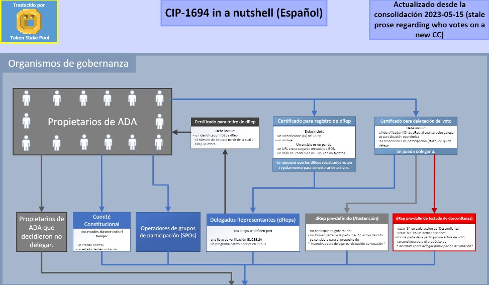
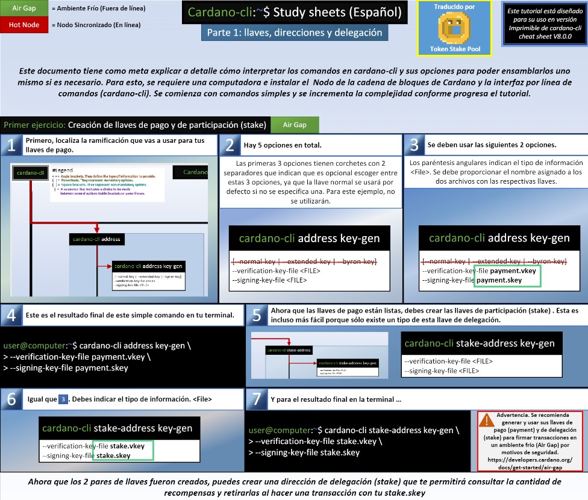
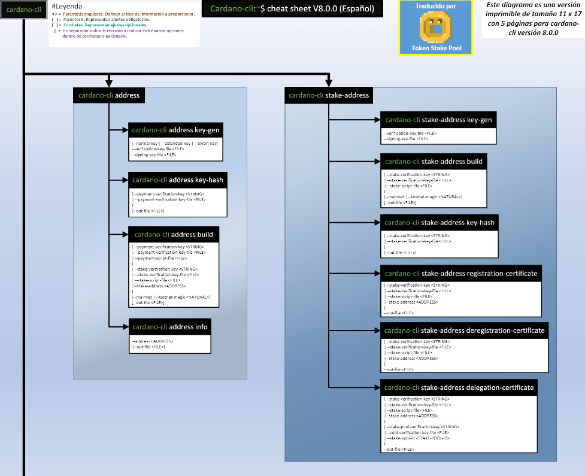

# CIP-1694

In collaboration with [ABLE] stake pool

- [x] CIP-1694 in a nutshell
- [x] cardano-cli cheat sheets
- [x] cardano-cli study sheets

Pending audit
- [x] IOG's CIP-1694 Diagram

**Translated by Token Stake Pool [TOKEN] / Traducido por Token Stake Pool [TOKEN]**
| From | To | Format |
| ----------- | ----------- | ----------- |
| English | Spanish | PDF

## CIP-1694 in a nutshell / CIP-1694 en resumen
**[Spanish - Español (PDF)](https://github.com/tokenstakepool/CIP-1694/blob/main/CIP-1694%20in%20a%20Nutshell%20(2023-05-15%20Español).pdf)**

## cardano-cli study sheets / notas de estudio para cardano-cli
**[Spanish - Español (PDF)](https://github.com/tokenstakepool/CIP-1694/blob/main/Cardano-cli%20Study%20sheet%20(Español).pdf)**

## cardano-cli cheat sheets / notas de referencia para cardano-cli
**[Spanish - Español (PDF)](https://github.com/tokenstakepool/CIP-1694/blob/main/Cardano-cli%20cheat%20sheet%20Español.pdf)**

> **Warning**
>
> I, TOKEN, volunteered to translate Cardano tutorials to Spanish in May of 2023.
> I am now involved in CIP-1694 in some way.
>
> To those of you still fighting to create a fair system:
> all things come to those who wait.

